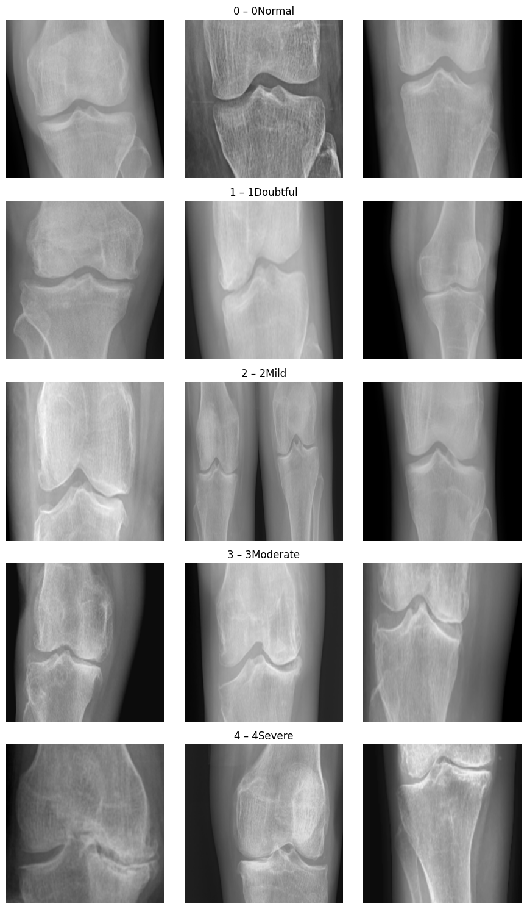

<div style="display: flex; justify-content: center;">
    
</div>


Key Features:

1. Intelligent Tuning:

2. Evaluates accuracy after initial training

    * Performs automatic fine-tuning if accuracy <80%

    * Unfreezes only the last layers to prevent overtuning.

3. Integrated Preprocessing:

    * Converts MNIST images (380x380, 1 channel) to the required format (380x380, 3 channels)

    * Normalizes pixel values

4. Complete Serialization:

    * Saves the entire model object (including weights and settings)

    * Can be loaded into another project without additional code

This implementation provides an optimal balance between ease of use and performance, automatically adapting to the data by fine-tuning when necessary.

Advantages of this Design

1. Loose Coupling:

    * Each class has a single responsibility.

1. Easy modification of individual components

2. High cohesion:

    * All evaluation-related code is in the Evaluator

    * All logging logic is in the TrainingMonitor

3. Extensibility:

    * Add new callbacks without modifying the core logic

    * Easy integration of new visualizations

4. Reusability:

    * The TrainingMonitor and Evaluator can be used with other models

    * Model-independent logging system

5. Automatic organization:

    * Consistent directory structure

    * All logs and visualizations are automatically saved
    



Key Benefits

1. Single Responsibility Principle:

    * TrainingMonitor: Exclusively for callback management and logging

    * Trainer: Only coordinates the training process

    * Evaluator: Only for evaluation and visualization

2. Flexible Configuration:


```
python
# Example: Change monitored metric
monitor = TrainingMonitor()
callbacks = monitor.create_callbacks(monitor_metric='val_accuracy', mode='max')
```


3. Extensibility:


```
python
# Add new callback without modifying existing classes
new_callback = MyCustomCallback()
model.train(..., custom_callbacks=[new_callback])
```
4. Consistency:

    * All experiments follow the same directory structure

    * Centralized callback configuration

    5. Reusability:

    * The monitoring system works with any Keras model

    * The trainer can be used with different architectures

This report includes several key metrics calculated for each class individually and averaged:

a) Precision

    * Formula: True Positives / (True Positives + False Positives)

    * Interpretation: Of all the examples that the model predicted as class X, what percentage were actually class X?

    * Importance: This is crucial when false positives are costly (e.g., incorrect medical diagnosis).

b) Recall/Sensitivity

    * Formula: True Positives / (True Positives + False Negatives)

    * Interpretation: Of all the examples that are actually class X, what percentage did the model correctly identify?

    * Importance: Essential when false negatives are critical (e.g., detecting rare diseases).

c) F1 Score

    * Formula: 2 * (Precision * Recall) / (Precision + Recall)

    * Interpretation: Harmonic mean between precision and recall.

    * Importance: Good balance when you need to consider both false positives (FP and FN).

d) ROC Curves (Receiver Operating Characteristic)

    * Shows the relationship between the True Positive Rate (Recall) and the False Positive Rate.

    * AUC (Area Under the Curve):

    * 1.0: Perfect classifier

    * 0.5: Equivalent to chance

    * In multiclass: A "one-vs-rest" strategy is used.

    * Interpretation: Shows the model's performance at all possible decision thresholds.

e) Precision-Recall Curves

    * Shows the relationship between Precision and Recall for different thresholds.

    * Importance: Especially useful when:

    * Classes are unbalanced

    * We are more interested in the positive class than the negative one

    * AUC: The area under this curve indicates good performance when it is close to 1.0

Learning Curves

    * Shows how training and validation scores evolve as the dataset size increases.

    * Important patterns:

    * Good fit: Both curves converge to a high value

    * Overfit: Large gap between curves (much higher training score)

    * Underfit: Both curves converge to a low value
    
---


### How to run it
```python
data_dir='../Training'
save_dir='./_logger_efficient_net'
BATCH_SIZE = 32
EPOCHS = 80
```

```python
# Inicialización
# Callbacks adicionales

model = ArthritisDetectionModel(class_Names = ['0Normal', '1Doubtful', '2Mild', '3Moderate', '4Severe'], save_dir=save_dir)
```

```python
preprocesor = DataProcessor(class_Names = ['0Normal', '1Doubtful', '2Mild', '3Moderate', '4Severe'], target_shape=(380, 380, 3))
X, y = preprocesor.load_dataset(data_dir)
y_categorical = tf.keras.utils.to_categorical(y, num_classes=5)
```
```python
X_train, X_test, y_train, y_test, y_train_cm, y_test_cm = preprocesor.Train_Split(X, y,y_categorical, test_size=0.2)
X_val, y_val = X_train[-60:], y_train[-60:]
X_train, y_train = X_train[:-60], y_train[:-60]
mk_cb = SaveBestKerasCallback(model, 'best_model_efficient_net.keras')
custom_cb = LearningRateScheduler(lr_schedule)
```

```python
# 2. Entrenar modelo
# Entrenamiento con callbacks preconfigurados + personalizados
history = model.train(
    X_train, y_train,
    X_val=X_val,
    y_val=y_val,
    epochs=EPOCHS,
    batch_size=BATCH_SIZE,
    custom_callbacks=[ mk_cb]  # Opcional
)
```

```python

ModelSerializer.save(model, "./export/best_model_efficient_net/")

# 3. Evaluar

loaded_model = ModelSerializer.load('./best_model_efficient_net.keras')

results = loaded_model.evaluate(X_test, y_test)


# 4. Usar para predicciones
sample_images = X_test[:5]  # 5 imágenes de ejemplo
predictions = loaded_model.predict(sample_images)


loaded_model.monitor.get_tensorboard_cmd()
# Usa la ruta exacta que imprimiste anteriormente
!kill 26471

%reload_ext tensorboard
%tensorboard --logdir _logger_efficient_net/'run_2025-07-14-04:12:22'/tensorboard --host 0.0.0.0
```


### DataProcessor - preprocessing class


```python

class DataProcessor:
    def __init__(self, class_Names:  list[str], target_shape=(380, 380, 3)):
        self.target_shape = target_shape
        self.class_names = class_Names

    def preprocess_knee_xray(self, img):
        """Preprocesamiento específico para radiografías de rodilla"""
        # Convertir a escala de grises
        gray = cv2.cvtColor(img, cv2.COLOR_RGB2GRAY)

        # Redimensionar
        gray = cv2.resize(gray, (self.target_shape[0],self.target_shape[1] ), interpolation=cv2.INTER_LINEAR)

        # Normalización Min-Max [0,1]
        gray = gray.astype('float32') / 255.0

        # CLAHE para mejora de contraste
        clahe = cv2.createCLAHE(clipLimit=2.0, tileGridSize=(8,8))
        gray = clahe.apply((gray * 255).astype('uint8')).astype('float32') / 255.0

        # Filtrado bilateral
        gray = cv2.bilateralFilter((gray * 255).astype('uint8'),
                                 d=5, sigmaColor=75, sigmaSpace=75)
        gray = gray.astype('float32') / 255.0

        # Convertir a 3 canales
        return np.stack([gray, gray, gray], axis=-1)

    def load_dataset(self, data_dir):
        """Carga y preprocesa el dataset completo"""
        images, labels = [], []
        for class_idx, class_name in enumerate(self.class_names):
            class_dir = os.path.join(data_dir, class_name)
            for img_name in os.listdir(class_dir):
                img_path = os.path.join(class_dir, img_name)
                img = cv2.imread(img_path, cv2.IMREAD_COLOR)
                img_pp = self.preprocess_knee_xray(img)
                images.append(img_pp)
                labels.append(class_idx)
        return np.array(images, dtype='float32'), np.array(labels, dtype='int')

    def preprocessImg(self, Img_input):
        """Carga y preprocesa el dataset completo"""
        img = cv2.imread(Img_input, cv2.IMREAD_COLOR)
        img_pp = self.preprocess_knee_xray(img)
        return img_pp

    def Train_Split(self, X, y,y_categorical, test_size =0.3):
        X_train, X_test, y_train, y_test, y_train_cm, y_test_cm = train_test_split( X, y_categorical, y, test_size=test_size, random_state=42, stratify=y)
        return X_train, X_test, y_train, y_test, y_train_cm, y_test_cm
```

### ModelBuilder 

1. Implementation of the CBAM Module:

* The `cbam_block` function implements the full CBAM attention mechanism.

* CBAM combines two types of attention:

* Channel attention: Learns which channels are most important.

* Spatial attention: Learns which spatial regions are most important.

2. Integration into the Residual Blocks:

* Modified the `residual_block` to include a `use_cbam` parameter that controls whether the attention module is applied.

* CBAM is applied after the convolutions but before the residual connection.

3. Removal of the Simple Attention Mechanism:

* I removed the simple attention mechanism you had at the end, as CBAM provides more sophisticated attention.

This implementation should improve the model's ability to focus on the most relevant features in both the channel and spatial dimensions, which can be particularly useful for arthritis detection where certain regions and features may be more indicative than others.

```python

@register_keras_serializable(package="CustomLayers")
class CBAMBlock(Layer):
    def __init__(self, ratio=8, kernel_size=7, **kwargs):
        super().__init__(**kwargs)
        self.ratio       = ratio
        self.kernel_size = kernel_size

        # ————— Channel attention (SE) —————
        # Estos Dense no necesitan build explícito: Keras infiere input dim en su primer call.
        self.dense1 = Dense(
            units=None,            # <-- lo dejamos en None para inferir input_dim dinámicamente
            activation='relu',
            use_bias=True
        )
        self.dense2 = Dense(
            units=None,            # <-- idem
            activation='sigmoid',
            use_bias=True
        )

        # ————— Spatial attention —————
        self.concat_sp = Concatenate(axis=-1)
        self.conv_spatial = Conv2D(
            filters=1,
            kernel_size=self.kernel_size,
            padding='same',
            activation='sigmoid',
            use_bias=False
        )

    def build(self, input_shape):
        # Aquí ajustamos las unidades de los Dense según el número de canales reales
        channels = int(input_shape[-1])
        self.dense1.units = max(channels // self.ratio, 1)
        self.dense2.units = channels
        # Llamamos al super para registrar que ya está "built"
        super().build(input_shape)

    def call(self, inputs):
        # 1) Channel Attention
        avg_pool = tf.reduce_mean(inputs, axis=[1,2], keepdims=True)
        max_pool = tf.reduce_max(inputs, axis=[1,2], keepdims=True)
        mlp_avg  = self.dense2(self.dense1(avg_pool))
        mlp_max  = self.dense2(self.dense1(max_pool))
        channel_att = Add()([mlp_avg, mlp_max])
        x = Multiply()([inputs, channel_att])

        # 2) Spatial Attention
        avg_sp = tf.reduce_mean(x, axis=-1, keepdims=True)
        max_sp = tf.reduce_max(x, axis=-1, keepdims=True)
        cat_sp = self.concat_sp([avg_sp, max_sp])
        spat_att = self.conv_spatial(cat_sp)
        return Multiply()([x, spat_att])

    def get_config(self):
        cfg = super().get_config()
        cfg.update({
            "ratio":       self.ratio,
            "kernel_size": self.kernel_size
        })
        return cfg

    # NO necesitamos compute_output_shape ni build_from_config si todo está en __init__ + get_config

@tf.keras.utils.register_keras_serializable(package="CustomLayers")
class SpatialAttention(Layer):
    def __init__(self, kernel_size=7, **kwargs):
        super().__init__(**kwargs)
        self.kernel_size = kernel_size
        self.conv = Conv2D(
            1,
            kernel_size=self.kernel_size,
            padding='same',
            activation='sigmoid'
        )

    def call(self, inputs):
        avg_pool = tf.reduce_mean(inputs, axis=-1, keepdims=True)
        max_pool = tf.reduce_max(inputs, axis=-1, keepdims=True)
        concat   = tf.concat([avg_pool, max_pool], axis=-1)
        att_map  = self.conv(concat)
        return inputs * att_map

    def get_config(self):
        config = super().get_config()
        config.update({"kernel_size": self.kernel_size})
        return config


class ModelBuilder:
    def __init__(self, input_shape=(380, 380, 3), num_classes=5):
        self.input_shape = input_shape
        self.num_classes = num_classes


    def build_base_model(self):
        """Arquitectura mejorada para detección de artritis con CBAM"""
        base_model = EfficientNetB4(
            weights='imagenet',
            include_top=False,
            #input_shape=(IMG_SIZE[0], IMG_SIZE[1], 3))
            input_shape=(self.input_shape[0], self.input_shape[1], 3))

        # Descongelar las capas convolucionales
        for layer in base_model.layers[-20:]:
            layer.trainable = True

        # Añadir nuevas capas para nuestra tarea
        x = base_model.output
        x = CBAMBlock(ratio=8, kernel_size=7)(x)          # <-- aquí ya es una capa pura
        x = GlobalAveragePooling2D()(x)
        x = Dense(512, activation='relu')(x)
        x = BatchNormalization()(x)
        x = Dropout(0.5)(x)
        predictions = Dense(self.num_classes, activation='softmax')(x)

        model = Model(inputs=base_model.input, outputs=predictions)

        return model

```

### Training Monitoring 

```python


class TrainingMonitor:
    def __init__(self, save_dir='training_logs'):
        self.save_dir = save_dir
        self.current_run_dir = None
        self.dirs = {}
    def create_directories(self):
        self._setup_directories()

    def _setup_directories(self):
        """Configura la estructura de directorios para el experimento"""
        self.save_dir = os.path.abspath(self.save_dir)
        os.makedirs(self.save_dir, exist_ok=True)
        timestamp = datetime.datetime.now().strftime("%Y-%m-%d-%H:%M:%S")
        self.current_run_dir = os.path.join(self.save_dir, f"run_{timestamp}")

        # Directorios específicos
        self.dirs = {
            'tensorboard': os.path.join(self.current_run_dir, "tensorboard"),
            'checkpoints': os.path.join(self.current_run_dir, "checkpoints"),
            'csv_logs': os.path.join(self.current_run_dir, "csv_logs"),
            'plots': os.path.join(self.current_run_dir, "visualizations")
        }

        for dir_path in self.dirs.values():
            os.makedirs(dir_path, exist_ok=True)
            print(f"Directorio creado: {dir_path}")  # Confirmación visual

    def create_callbacks(self, model_name='model', monitor_metric='val_accuracy', mode='max', patience=200):
        """Factory de callbacks esenciales"""
        print(f"Callbacks configurados en: {self.dirs}")  # Verificación

        return [
            # Callback para guardar el mejor modelo completo
            callbacks.ModelCheckpoint(
                filepath=os.path.join(self.dirs['checkpoints'], f'best_{model_name}.keras'),
                monitor=monitor_metric,
                save_best_only=True,
                save_weights_only=False,
                mode=mode,
                verbose=1
            ),
            # Callback para guardar solo pesos
            callbacks.ModelCheckpoint(
                filepath=os.path.join(self.dirs['checkpoints'], f'{model_name}_weights.weights.h5'),
                monitor=monitor_metric,
                save_best_only=True,
                save_weights_only=True,
                mode=mode,
                verbose=1
            ),
            # Early stopping
            callbacks.EarlyStopping(
                monitor=monitor_metric,
                patience=patience,
                restore_best_weights=True,
                mode=mode
            ),
            # TensorBoard
            callbacks.TensorBoard(
                log_dir=self.dirs['tensorboard'],
                histogram_freq=1,
                profile_batch='500,520'
            ),
            # CSV Logger
            callbacks.CSVLogger(
                filename=os.path.join(self.dirs['csv_logs'], 'training_metrics.csv'),
                separator=',',
                append=False
            ),
            ReduceLROnPlateau(monitor=monitor_metric, factor=0.5, patience=10, verbose=1),
        ]

    def get_tensorboard_cmd(self):
        """Genera el comando para lanzar TensorBoard"""
        return f"tensorboard --logdir {self.dirs['tensorboard']}"

```

### Trainer - Handles training and fine-tuning

1. Knee X-ray Based (KOA)

    A recent study used methods such as slight rotation, horizontal cropping, and adversarial augmentation, finding that rotation and zoom/crop were more useful than flips or abrupt cuts.

* Limited rotation (±10°) – already included

* Random zoom/crop centered on the joint (e.g., zoom_range=0.1, crop 90–110%, then crop to 380x380).

* Adversarial augmentation: adding subtle noise for robustness.

```python


# trainer.py
class Trainer:
    def __init__(self, keras_model, monitor):
        """
        Args:
            keras_model: Modelo compilado de Keras (no la clase contenedora)
            monitor: Instancia de TrainingMonitor
        """
        self.keras_model = keras_model
        self.monitor = monitor
    def unfreeze_and_finetune(self, model):
      # Descongelar las últimas capas convolucionales
      for layer in model.layers[-20:]:
          if not isinstance(layer, BatchNormalization):
              layer.trainable = True

      model.compile(
          optimizer=Adam(learning_rate=1e-5),  # Tasa de aprendizaje más baja
          loss='categorical_crossentropy',
          metrics=['accuracy', tf.keras.metrics.AUC(name='auc')])

      return model

    def train(self, X_train, y_train, X_val=None, y_val=None,
             batch_size=80, epochs=100, custom_callbacks=None, verbose=1):
        """
        Ejecuta el entrenamiento del modelo Keras

        Args:
            verbose: 0=silencioso, 1=barra de progreso, 2=una línea por época
        """
        callbacks_list = self.monitor.create_callbacks()

        if custom_callbacks:
            callbacks_list.extend(
                custom_callbacks if isinstance(custom_callbacks, list)
                else [custom_callbacks]
            )

        train_datagen = ImageDataGenerator(
            rotation_range=15,
            width_shift_range=0.1,
            height_shift_range=0.1,
            shear_range=0.1,
            zoom_range=0.1,
            horizontal_flip=True,
            fill_mode='nearest')

        train_generator = train_datagen.flow(X_train, y_train, batch_size=batch_size)

        print(">>> DEBUG TYPES <<<")
        print("  x:",   type(X_train),  " y:",   type(y_train))
        print("  val:", type(X_val),    type(y_val))
        print("  batch_size:", batch_size)
        print("  callbacks:", callbacks_list)

        history = self.keras_model.fit(
            train_generator,
            steps_per_epoch=len(X_train) // batch_size,
            validation_data=(X_val, y_val) if X_val is not None else None,
            batch_size=batch_size,
            epochs=epochs,
            callbacks=callbacks_list,
            verbose=1
        )
        results = self.keras_model.evaluate(X_val, y_val, verbose=1)
        loss, acc = results[:2]

        if acc < 0.90:  # Umbral arbitrario
          print("\nIniciando fine-tuning...")
          self.keras_model = self.unfreeze_and_finetune(self.keras_model)

          history = self.keras_model.fit(
              train_generator,
              steps_per_epoch=len(X_train) // batch_size,
              epochs=200,  # Menos épocas para fine-tuning
              validation_data=(X_val, y_val) if X_val is not None else None,
              callbacks=callbacks_list,
              verbose=1)

        sys.stdout.flush()  # Vacía los buffers de salida
        time.sleep(2)
        return history

```

### Evaluator - Handles evaluation and visualization

```python

class Evaluator:
    def __init__(self, class_Names, monitor=None):
        self.monitor = monitor
        self.class_names =class_Names
    def evaluate_model(self, model, X_test, y_test):
        """Evalúa el modelo con soporte para one-hot y labels"""
        # 1. Convertir y_test a labels si está en one-hot
        if y_test.shape[1] > 1:  # Si es one-hot (330, 5)
            y_test_labels = np.argmax(y_test, axis=1)
        else:  # Si ya son labels (330,)
            y_test_labels = y_test

        # 2. Evaluación numérica (adaptada para one-hot)
        metrics = model.evaluate(X_test, y_test, verbose=0)
        if isinstance(metrics, list):
            loss = metrics[0]
            print(f"Pérdida: {loss:.4f}")
            if len(metrics) > 1:
                print("Métricas adicionales:")
                for name, value in zip(model.metrics_names[1:], metrics[1:]):
                    print(f"{name}: {value:.4f}")
        else:
            loss = metrics
            print(f"Pérdida: {loss:.4f}")

        # 3. Generar predicciones
        y_pred = model.predict(X_test)
        y_pred_labels = np.argmax(y_pred, axis=1)  # Convertir probabilidades a labels

        # 4. Reporte de clasificación
        print("\nClassification Report:")
        print(classification_report(
            y_test_labels,
            y_pred_labels,
            target_names=self.class_names,
            digits=4
        ))

        # 5. Matriz de confusión
        self._plot_confusion_matrix(y_test_labels, y_pred_labels)

        return {
            'loss': loss,
            'accuracy': accuracy_score(y_test_labels, y_pred_labels),
            'y_true': y_test_labels,
            'y_pred': y_pred_labels
        }


    def _plot_confusion_matrix(self, y_true, y_pred, classes=None):
        """Visualiza la matriz de confusión"""
        cm = confusion_matrix(y_true, y_pred)
        plt.figure(figsize=(10, 8))
        sns.heatmap(cm, annot=True, fmt='d', cmap='Blues',
                    xticklabels=classes or range(5),
                    yticklabels=classes or range(5))
        plt.xlabel('Predicted')
        plt.ylabel('True')
        plt.title('Confusion Matrix')

        if self.monitor and self.monitor.current_run_dir:
            # Asegurarse de que el directorio plots existe
            plots_dir = os.path.join(self.monitor.current_run_dir, "plots")
            os.makedirs(plots_dir, exist_ok=True)  # Esto crea el directorio si no existe

            plot_path = os.path.join(plots_dir, "confusion_matrix.png")
            plt.savefig(plot_path)
        plt.show()


    def _plot_training_history(self, history_dict):
        """Visualiza las métricas de entrenamiento"""
        plt.figure(figsize=(12, 5))
        if not hasattr(history, 'history'):
            print("No hay datos de historial para graficar")
            return
        # Gráfico de pérdida
        plt.subplot(1, 2, 1)
        if 'loss' in history_dict:
            plt.plot(history_dict['loss'], label='Train Loss')
        if 'val_loss' in history_dict:
            plt.plot(history_dict['val_loss'], label='Val Loss')
        plt.title('Training and Validation Loss')
        plt.xlabel('Epoch')
        plt.ylabel('Loss')
        plt.legend()

        # Gráfico de accuracy (si existe)
        plt.subplot(1, 2, 2)
        if 'accuracy' in history_dict:
            plt.plot(history_dict['accuracy'], label='Train Accuracy')
        if 'val_accuracy' in history_dict:
            plt.plot(history_dict['val_accuracy'], label='Val Accuracy')
        plt.title('Training and Validation Accuracy')
        plt.xlabel('Epoch')
        plt.ylabel('Accuracy')
        plt.legend()

        plt.tight_layout()

        if self.monitor and self.monitor.current_run_dir:
            plot_path = os.path.join(self.monitor.current_run_dir, "plots", "training_metrics.png")
            plt.savefig(plot_path)
        plt.show()

```

###  Módulo ModelSerializer

```python

# ===== Registra aquí cualquier capa/función custom =====
CUSTOM_OBJECTS = {
    'spatial_average': Utils.spatial_average  # añade más si los usas
}
tf.keras.utils.get_custom_objects().update(CUSTOM_OBJECTS)
# =======================================================
# callbacks.py
from tensorflow.keras.callbacks import Callback

class SaveBestKerasCallback(Callback):
    """
    Guarda el .keras + metadata.json cuando la métrica monitorizada mejora.
    """
    def __init__(self, arthritis_model, export_dir,
                 monitor="val_accuracy", mode="max"):
        super().__init__()
        self.arthritis_model = arthritis_model
        self.export_dir      = export_dir
        self.monitor         = monitor
        self.mode            = mode
        self.best_val        = -float("inf") if mode == "max" else float("inf")

    def on_epoch_end(self, epoch, logs=None):
        current = logs.get(self.monitor)
        if current is None:  # métrica inexistente
            return

        improved = (current > self.best_val) if self.mode == "max" else (current < self.best_val)
        if improved:
            self.best_val = current
            ModelSerializer.save(self.arthritis_model, self.export_dir)
            print(f"\n💾 Epoch {epoch:03d} – {self.monitor} mejoró a {current:.4f}. Modelo guardado.")


class ModelSerializer:
    """
    Guarda y carga la instancia ArthritisDetectionModel:
      • modelo Keras ⇒ formate .keras
      • metadatos      ⇒ metadata.json
    """
    MODEL_NAME   = "model.keras"
    METADATA_NM  = "metadata.json"

    # ---------- GUARDAR ----------
    @staticmethod
    def save(arthritis_model, export_dir: str | Path):
        export_dir = Path(export_dir)
        export_dir.mkdir(parents=True, exist_ok=True)

        # 1) Modelo completo (.keras)
        model_path = export_dir / ModelSerializer.MODEL_NAME
        arthritis_model.model.layers[-1].activation = tf.keras.activations.softmax

        arthritis_model.model.save(model_path, include_optimizer=True)
        print(f"✅ Modelo guardado en {model_path}")

        # 2) Metadatos JSON
        metadata = {
            "processor_config": {
                "target_shape": arthritis_model.data_processor.target_shape,
                "class_Names":  arthritis_model.data_processor.class_names
            },
            "builder_config": {
                "input_shape": arthritis_model.model_builder.input_shape,
                "num_classes": arthritis_model.model_builder.num_classes
            },
            "monitor_config": {
                "save_dir":        arthritis_model.monitor.save_dir,
                "current_run_dir": arthritis_model.monitor.current_run_dir,
                "dirs":            arthritis_model.monitor.dirs
            },
            "export_date": datetime.datetime.now().isoformat()
        }
        with open(export_dir / ModelSerializer.METADATA_NM, "w", encoding="utf-8") as f:
            json.dump(metadata, f, indent=2)
        print(f"✅ Metadatos guardados en {export_dir / ModelSerializer.METADATA_NM}")

    # ---------- CARGAR ----------
    @staticmethod
    def load(export_dir: str | Path):
        export_dir = Path(export_dir)

        # 0) Comprobaciones
        model_path = export_dir / ModelSerializer.MODEL_NAME
        meta_path  = export_dir / ModelSerializer.METADATA_NM
        if not model_path.exists() or not meta_path.exists():
            raise FileNotFoundError("No se encontraron model.keras y/o metadata.json")

        # 1) Cargar metadatos
        with open(meta_path, "r", encoding="utf-8") as f:
            metadata = json.load(f)

        # 2) Reconstruir objetos auxiliares
        loaded = ArthritisDetectionModel(
            class_Names = metadata["processor_config"]["class_Names"],
            save_dir    = metadata["monitor_config"]["save_dir"],
            input_shape = tuple(metadata["builder_config"]["input_shape"])
        )

        # 3) Sobrescribir monitor con la estructura original
        loaded.monitor.current_run_dir = metadata["monitor_config"]["current_run_dir"]
        loaded.monitor.dirs            = metadata["monitor_config"]["dirs"]

        # 4) Cargar modelo Keras con objetos custom
        loaded.model = tf.keras.models.load_model(
            model_path,
            custom_objects=CUSTOM_OBJECTS
        )

        # 5) Actualizar trainer y evaluator
        loaded.trainer   = Trainer(loaded.model, loaded.monitor)
        loaded.evaluator = Evaluator(loaded.data_processor.class_names, loaded.monitor)

        print(f"✅ Modelo restaurado desde {model_path}")
        return loaded

```

### ArthritisDetectionModel - Main Class with Composition

```python

class ArthritisDetectionModel:
    def __init__(self,class_Names : list[str], save_dir='_logger', input_shape=(380, 380, 3)):
        self.train_datagen = None
        self.data_processor = DataProcessor(class_Names=class_Names, target_shape=input_shape)
        self.model_builder = ModelBuilder(input_shape=input_shape)
        self.monitor =  TrainingMonitor(save_dir)
        self.evaluator = Evaluator(class_Names, self.monitor)
        self.model = None  # Modelo interno de Keras
        self.history = None
        self.trainer = None  # Se inicializará después de compilar
        # 2. Aumentación de datos específica para radiografías

    def _ensure_compiled(self):
        """Garantiza que el modelo está construido y compilado"""
        if self.model is None:
            self.model = self.model_builder.build_base_model()
            self.model.compile(
                optimizer=tf.keras.optimizers.Adam(1e-4),
                loss='categorical_crossentropy',
                metrics=['accuracy', tf.keras.metrics.AUC(name='auc')]
            )

            self.trainer = Trainer(self.model, self.monitor)


    def train(self, X_train, y_train, X_val, y_val, **kwargs):
        """Entrena el modelo"""
        self.monitor.create_directories()
        sys.stdout.flush()  # Vacía los buffers de salida
        time.sleep(2)
        # Garantizar modelo listo
        self._ensure_compiled()

        # Entrenamiento
        self.history = self.trainer.train(
            X_train, y_train,
            X_val=X_val,
            y_val=y_val,
            verbose=1,
            **kwargs
        )

        return self.history

    def evaluate(self, X_test, y_test):
      """Evalúa el modelo con preprocesamiento automático"""
      try:
          if self.monitor is None:
            print('Monitor is not initialized')
            raise
          # Preprocesamiento automático
          return self.evaluator.evaluate_model(self.model, X_test, y_test)
      except Exception as e:
          print(f"Error durante la evaluación: {str(e)}")
          raise

    def predict(self, X):
        return self.model.predict(X)

    def save(self, filepath):
        """Guarda el modelo completo"""
        ModelSerializer.save(self, filepath)

    @classmethod
    def load(cls, filepath):
        """Carga un modelo guardado"""
        return ModelSerializer.load(filepath)

```
