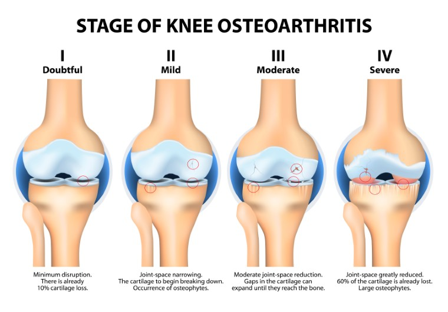

# Efficient-Net-CNN-stage-of-knee-osteoarthritis-detector


Características clave:


1. Fine-Tuning Inteligente:

2. Evalúa el accuracy después del entrenamiento inicial

  * Realiza fine-tuning automático si el accuracy < 80%

  * Descongela solo las últimas capas para evitar overfitting

3. Preprocesamiento Integrado:

  *  Convierte imágenes MNIST (380*380, 1 canal) al formato requerido (380*380, 3 canales)

  * Normaliza los valores de píxeles

4. Serialización Completa:

  * Guarda todo el objeto modelo (incluyendo pesos y configuración)

  * Puede cargarse en otro proyecto sin necesidad de código adicional

Esta implementación proporciona un balance óptimo entre facilidad de uso y rendimiento, adaptándose automáticamente a los datos mediante el fine-tuning cuando es necesario.


Ventajas de este Diseño
1. Bajo acoplamiento:

  * Cada clase tiene una sola responsabilidad

  * Fácil modificar componentes individuales

2. Alta cohesión:

  * Todo el código relacionado con evaluación está en Evaluator

  * Toda la lógica de logging en TrainingMonitor

3. Extensibilidad:

  * Añadir nuevos callbacks sin modificar la lógica principal

  * Fácil integrar nuevas visualizaciones

4. Reusabilidad:

  * TrainingMonitor y Evaluator pueden usarse con otros modelos

  * Sistema de logging independiente del modelo específico

5. Organización automática:

  * Estructura de directorios consistente

  * Todos los logs y visualizaciones guardados automáticamente
  
Características clave:


1. Fine-Tuning Inteligente:

2. Evalúa el accuracy después del entrenamiento inicial

  * Realiza fine-tuning automático si el accuracy < 80%

  * Descongela solo las últimas capas para evitar overfitting

3. Preprocesamiento Integrado:

  *  Convierte imágenes MNIST (380*380, 1 canal) al formato requerido (380*380, 3 canales)

  * Normaliza los valores de píxeles

4. Serialización Completa:

  * Guarda todo el objeto modelo (incluyendo pesos y configuración)

  * Puede cargarse en otro proyecto sin necesidad de código adicional

Esta implementación proporciona un balance óptimo entre facilidad de uso y rendimiento, adaptándose automáticamente a los datos mediante el fine-tuning cuando es necesario.


Ventajas de este Diseño
1. Bajo acoplamiento:

  * Cada clase tiene una sola responsabilidad

  * Fácil modificar componentes individuales

2. Alta cohesión:

  * Todo el código relacionado con evaluación está en Evaluator

  * Toda la lógica de logging en TrainingMonitor

3. Extensibilidad:

  * Añadir nuevos callbacks sin modificar la lógica principal

  * Fácil integrar nuevas visualizaciones

4. Reusabilidad:

  * TrainingMonitor y Evaluator pueden usarse con otros modelos

  * Sistema de logging independiente del modelo específico

5. Organización automática:

  * Estructura de directorios consistente

  * Todos los logs y visualizaciones guardados automáticamente

Beneficios Clave
1. Single Responsibility Principle:

  * TrainingMonitor: Exclusivamente para gestión de callbacks y logging

  * Trainer: Solo coordina el proceso de entrenamiento

  * Evaluator: Únicamente para evaluación y visualización

2. Configuración Flexible:


```
python
# Ejemplo: Cambiar métrica monitoreada
monitor = TrainingMonitor()
callbacks = monitor.create_callbacks(monitor_metric='val_accuracy', mode='max')
```


3. Extensibilidad:


```
python
# Añadir nuevo callback sin modificar clases existentes
new_callback = MyCustomCallback()
model.train(..., custom_callbacks=[new_callback])
```

4. Consistencia:

    * Todos los experimentos siguen misma estructura de directorios

    * Configuración de callbacks centralizada

5. Reusabilidad:

    * El sistema de monitorización funciona con cualquier modelo Keras

    * El Trainer puede usarse con diferentes arquitecturas

Este reporte incluye varias métricas clave calculadas para cada clase individualmente y promediadas:

a) Precisión (Precision)
* Fórmula: Verdaderos Positivos / (Verdaderos Positivos + Falsos Positivos)

* Interpretación: De todos los ejemplos que el modelo predijo como clase X, ¿qué porcentaje realmente era de clase X?

* Importancia: Es crucial cuando los falsos positivos son costosos (ej.: diagnóstico médico erróneo).

b) Exhaustividad (Recall/Sensibilidad)

* Fórmula: Verdaderos Positivos / (Verdaderos Positivos + Falsos Negativos)

* Interpretación: De todos los ejemplos que realmente son de clase X, ¿qué porcentaje identificó correctamente el modelo?

* Importancia: Esencial cuando los falsos negativos son críticos (ej.: detectar enfermedades raras).

c) Puntaje F1 (F1-score)

* Fórmula: 2 * (Precision * Recall) / (Precision + Recall)
V
* Interpretación: Media armónica entre precisión y exhaustividad.

* Importancia: Buen balance cuando necesitas considerar ambos errores (FP y FN).

d) Curvas ROC (Receiver Operating Characteristic)

* Muestra relación entre Tasa de Verdaderos Positivos (Recall) y Tasa de Falsos Positivos.

* AUC (Area Under Curve):

 * 1.0: Clasificador perfecto

 * 0.5: Equivalente a azar

* En multiclase: Se usa estrategia "uno contra el resto" (One-vs-Rest)

* Interpretación: Muestra el rendimiento del modelo en todos los umbrales de decisión posibles.
e) Curvas Precision-Recall
* Muestra elación entre Precisión y Exhaustividad para diferentes umbrales.

* Importancia: Especialmente útil cuando:

 * Las clases están desbalanceadas

 * Nos interesa más la clase positiva que la negativa

* AUC: Área bajo esta curva indica buen rendimiento cuando está cerca de 1.0
Curvas de Aprendizaje

* Muestra cómo evolucionan los scores de entrenamiento y validación según aumenta el tamaño del dataset.

* Patrones importantes:

 * Buen ajuste: Ambas curvas convergen a un valor alto

 * Sobreajuste: Brecha grande entre curvas (train score mucho mayor)

 * Subajuste: Ambas curvas convergen a valor bajo 

2. Configuración Flexible:


```
python
# Ejemplo: Cambiar métrica monitoreada
monitor = TrainingMonitor()
callbacks = monitor.create_callbacks(monitor_metric='val_accuracy', mode='max')
```

